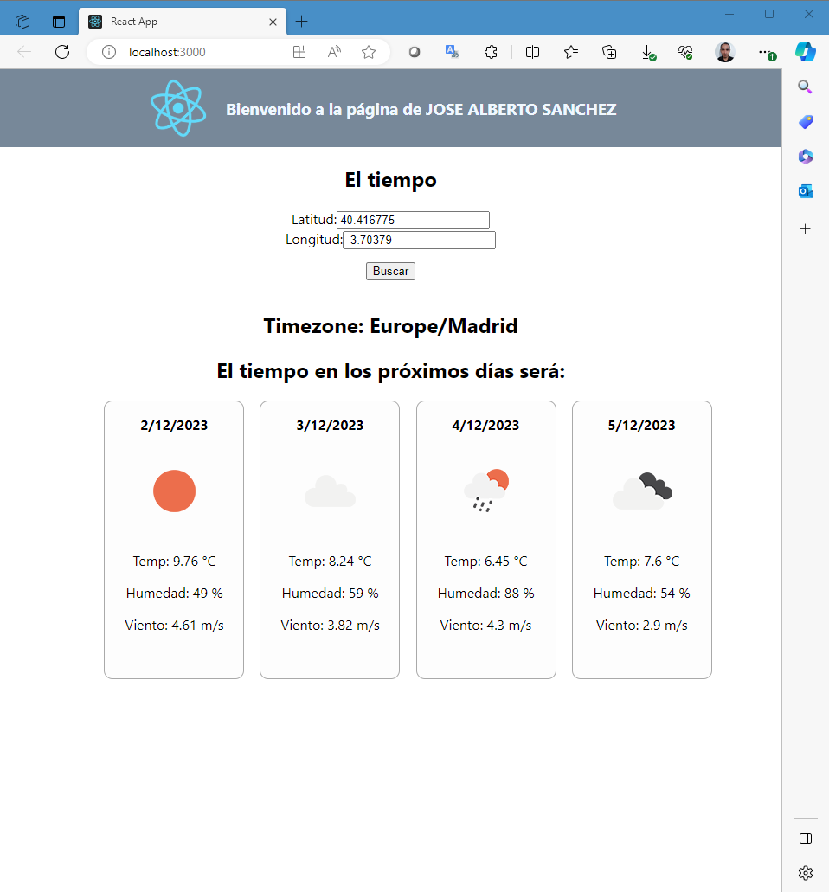
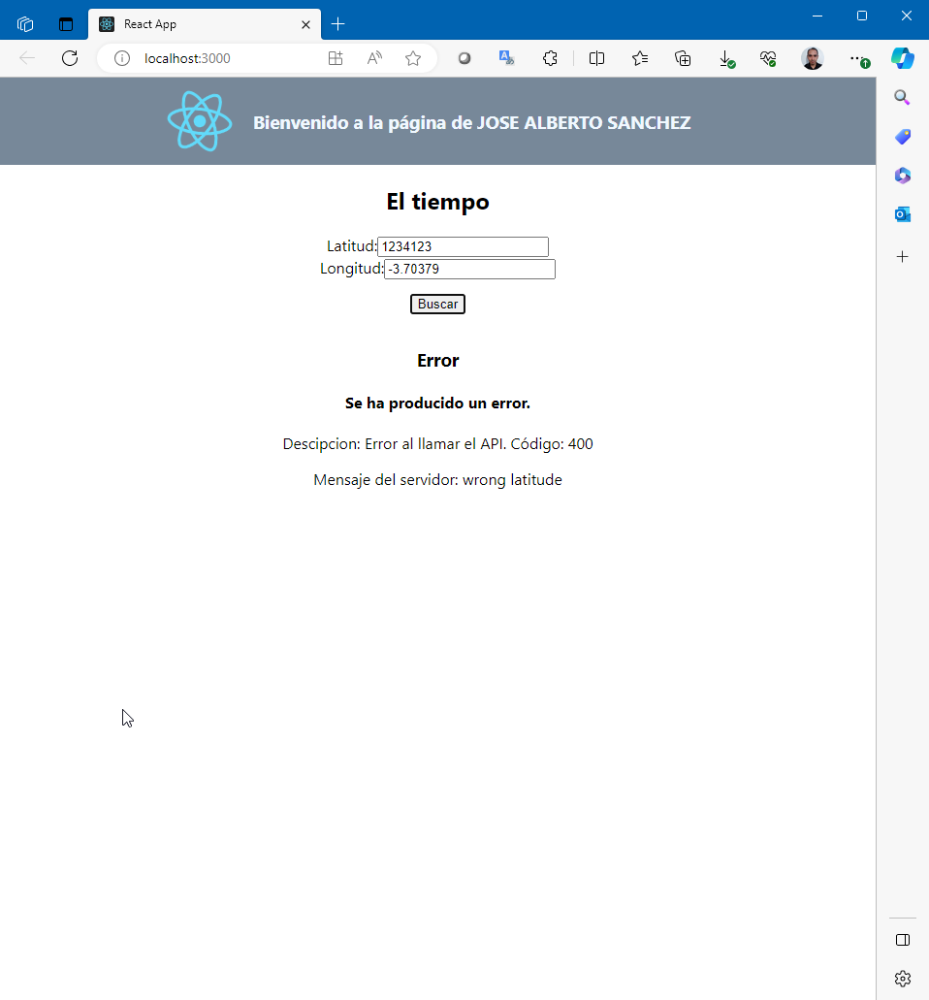

# Wheather Forecast example using React

Solution for P1_el_tiempo from React Native course by UPM taken in MiriadaX.

This project shows how to consume a weather API and get the forecast using the location (logitude & latitude).

    
    

## Requirements

- NodeJS 16 (LTS)+

## Setup

1. Install dependencies `npm install`
2. Run project `npm start`
